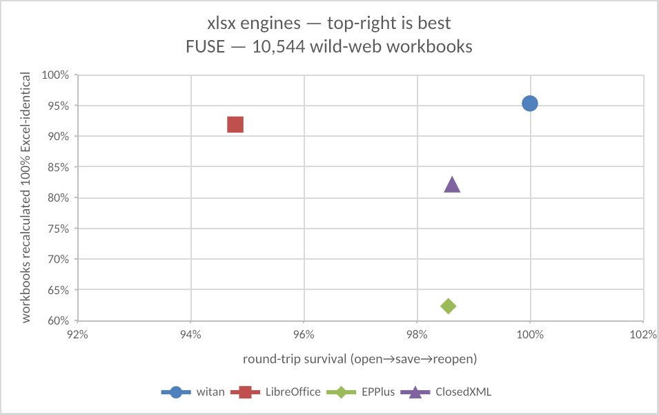
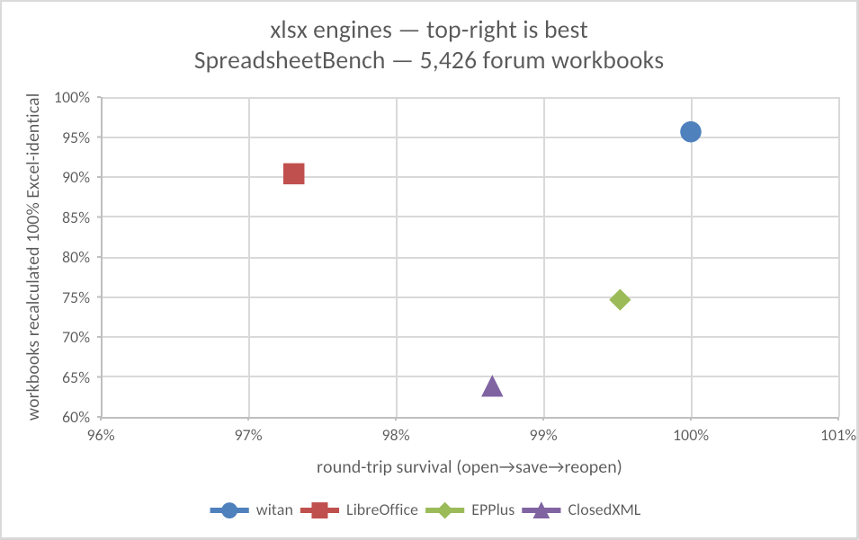

# xlsx-corpus-bench

Corpus-based, reproducible measurement of how well xlsx libraries handle
real-world workbooks — with **Microsoft Excel itself as the ground truth**
for recalculation. Every number has an external denominator (a public
corpus) and a binary, automated pass/fail: no hand-picked feature lists, no
judgment calls, no blended scores.

## Results

Two complementary public corpora — **15,970 real-world workbooks, 6.8M
formula cells** — bracketing the space: FUSE is the open web (old, hostile,
every producer imaginable), SpreadsheetBench is what people actually work
on today (modern, formula-heavy forum workbooks). Last full run: 2026-06-12 (witan); 2026-06-11 (others)
(library versions in [results-sb/versions.json](results-sb/versions.json)).

**FUSE** — 10,544 workbooks crawled from the open web:



<!-- table:results-fuse:start -->
| library | opens without error | survives open→save→reopen | workbooks recalculated 100% Excel-identical | formula cells matching Excel (of 5,671,240) |
|---|---|---|---|---|
| witan | **100.0%** | **100.0%** | **95.3%** | **99.7%** |
| LibreOffice | 100.0% | 94.8% | 91.9% | 98.9% |
| ClosedXML | 99.7% | 98.6% | 82.1% | 69.0% |
| EPPlus | 98.6% | 98.6% | 62.3% | 52.2% |
| openpyxl | 99.9% | 99.9% | N/A — no calculation engine |  |
<!-- table:results-fuse:end -->

**SpreadsheetBench** — 5,426 workbooks from real Excel forum questions:



<!-- table:results-sb:start -->
| library | opens without error | survives open→save→reopen | workbooks recalculated 100% Excel-identical | formula cells matching Excel (of 1,163,936) |
|---|---|---|---|---|
| witan | **100.0%** | **100.0%** | **95.7%** | **99.8%** |
| LibreOffice | **100.0%** | 97.3% | 90.4% | 96.7% |
| EPPlus | 99.8% | 99.5% | 74.6% | 68.0% |
| ClosedXML | 99.5% | 98.7% | 63.8% | 39.4% |
| openpyxl | **100.0%** | 99.8% | N/A — no calculation engine |  |
<!-- table:results-sb:end -->

Full tables with denominators and per-library error signatures:
[results-sb/REPORT.md](results-sb/REPORT.md) and
[results-fuse/REPORT.md](results-fuse/REPORT.md). Per-file receipts:
`results*/<lib>.jsonl` and `results*/truth-compare/<lib>.jsonl`.
The charts are authored and rendered by witan itself ([harness/make_charts.py](harness/make_charts.py)).

## What is measured

For every workbook in the universe, for every library:

| metric | definition |
|---|---|
| **opens without error** | the library opens the file and enumerates every sheet's dimensions |
| **survives open→save→reopen** | the library loads the file, writes it back out, reloads its own output without error, **and** the output passes a library-neutral structural validation of the OOXML package ([harness/opc_validate.py](harness/opc_validate.py): readable zip, well-formed XML parts, all relationship targets resolve) |
| **recalculation vs Excel** | real Excel recomputes every workbook (forced full recalculation via `fullCalcOnLoad`, links not updated, driven by [harness/excel_truth.py](harness/excel_truth.py)); each engine then recalculates the same workbooks and the harness compares both sides' values with one shared comparator ([harness/compare_truth.py](harness/compare_truth.py) + [harness/cached_values.py](harness/cached_values.py)). Reported two ways: % of workbooks with *zero* mismatched cells, and % of all formula cells matching |

### The universe rule

Each corpus's comparison universe is **the files Excel itself can process**
(it could open and re-save them during truth generation; the few it cannot
are listed in `results*/excel-truth-skips.jsonl`). Every library is measured
on exactly that set — and a library failure inside the universe counts
against the library rather than shrinking its denominator: an engine that
produces no output for a workbook is scored as mismatching all of it.

### Comparator rules (all engines, identically)

- numbers compared with 1e-9 relative tolerance; strings exact; errors by code
- volatile formulas excluded — own formula only, five names
  (`NOW`/`TODAY`/`RAND`/`RANDBETWEEN`/`RANDARRAY`), one visible line of code
- a cell Excel computed but the engine dropped counts as a mismatch
- external-workbook references stay in (xlsx caches external values
  precisely so formulas evaluate offline; Excel's closed-workbook semantics,
  including `*IF(S)` returning `#VALUE!` over closed refs, are the truth)

The raw per-file results also record each engine's self-reported
recalc-vs-cached-values comparison, but it is deliberately not reported:
cached values reflect whatever application last saved the file, so it
measures corpus provenance as much as library quality.

## Why this is hard to argue with

- **External denominators.** Public corpora, fixed by sha256 manifests
  (`results*/manifest.jsonl`). Nobody chose which features to test; the
  files did, weighted by how often things occur in the wild.
- **Excel is the oracle.** Recalculation is judged against what Microsoft
  Excel actually computes, not against a spec reading or our own opinion.
- **Binary automated checks**, one shared comparator, identical universe
  for every library.
- **Receipts.** Per-file JSONL for every library and metric, failing
  outputs preserved for inspection, library versions pinned
  ([results-sb/versions.json](results-sb/versions.json)).
- **Reproducible end to end** — see below.

## Corpora

**FUSE** ([Zenodo](https://zenodo.org/record/581678), CC-BY 4.0): 249,376
spreadsheets extracted from Common Crawl by Barik et al. (MSR 2015), of
which **10,702 are OOXML workbooks** (detected by content — zip magic +
`xl/workbook.xml`; FUSE stores bare sha1 names); 10,544 form the universe.
The rest are mostly pre-2007 OLE `.xls`, skipped with counts logged by
[harness/fuse_extract.py](harness/fuse_extract.py).

```bash
brew install sevenzip                              # 7zz, for the solid 7z inside fuse.zip
python3 harness/fetch_corpus.py fuse               # 9.4 GB download, ~25 GB free needed
```

**SpreadsheetBench**
([RUCKBReasoning/SpreadsheetBench](https://github.com/RUCKBReasoning/SpreadsheetBench)):
workbooks from real Excel forum questions. 5,455 unique by sha256; 5,426
form the universe (29 files Excel cannot process).

```bash
python3 harness/fetch_corpus.py spreadsheetbench   # ~100 MB
```

The harness is corpus-agnostic: point `harness/manifest.py` at any
directory of xlsx/xlsm files and pass `--results-dir`/`--corpus` to keep
result sets separate (SpreadsheetBench uses `results-sb/` + `corpus-sb/`,
FUSE uses `results-fuse/` + `corpus-fuse/`).

## Libraries under test

| library | driven via |
|---|---|
| witan | public [`witan` CLI](https://www.npmjs.com/package/witan) by default (`npm i -g witan`; run `witan auth login` first — anonymous traffic is rate-limited at corpus scale); `exec` for load/reload, `xlsx rpc` save for round-trip, `calc` for recalculation. Set `WITAN_XLSX_SERVE` to a local engine build to run offline |
| [openpyxl](https://openpyxl.readthedocs.io/) | Python API; no calculation engine → recalc N/A |
| [EPPlus](https://github.com/EPPlusSoftware/EPPlus) | .NET API; `Workbook.Calculate()`, computed values emitted as JSON for the shared comparator (NonCommercial license context) |
| [ClosedXML](https://github.com/ClosedXML/ClosedXML) | .NET API; `RecalculateAllFormulas()`, computed values emitted as JSON |
| [LibreOffice](https://www.libreoffice.org/) | `soffice --headless --convert-to xlsx`; recalculation by forcing recalc-on-load (`OOXMLRecalcMode=0`) and extracting the written values |

Exact versions per run: [results-sb/versions.json](results-sb/versions.json).
Environment: macOS, Python 3.13, .NET 10, Node ≥ 22.

**Aspose.Cells is not included.** Its commercial license should be checked
for published-benchmark restrictions (DeWitt-style clauses) before adding
it; the runner protocol below makes that mechanical once cleared.

## Running it

```bash
pip install openpyxl
dotnet build -c Release harness/runners/dotnet
brew install --cask libreoffice          # macOS
npm install -g witan && witan auth login    # or: export WITAN_XLSX_SERVE=/path/to/local/engine

# 1. corpus + manifest (idempotent; fixes the file set)
python3 harness/fetch_corpus.py spreadsheetbench

# 2. per-library benchmark runs (load / round-trip), resumable
python3 harness/run.py --lib openpyxl    # repeat for witan epplus closedxml libreoffice

# 3. Excel ground truth (macOS, drives real Excel; hours)
python3 harness/excel_truth.py

# 4. judge every engine against Excel
python3 harness/compare_truth.py --lib witan     # repeat per engine

# 5. report
python3 harness/report.py                # writes results-sb/REPORT.md
```

For the second corpus add `--results-dir results-fuse --corpus corpus-fuse`
to each step. Everything is resumable (append-only JSONL keyed by sha256).
Supporting tools: `harness/failure_report.py` (team-facing failure triage),
`harness/recalc_gap_report.py` (witan mismatches classified by function),
`harness/revalidate.py` (re-judge round-trips after validator changes).

## Adding a library

A runner is any executable taking `--corpus --manifest --out --out-dir`
that appends one JSON line per manifest entry:

```json
{"sha256": "...", "path": "...", "lib": "name",
 "load":      {"ok": true,  "ms": 12, "error": null},
 "roundtrip": {"ok": true,  "ms": 30, "error": null, "out": "<saved file>"},
 "recalc":    {"supported": true, "ok": true, "ms": 40,
               "formula_cells": 100, "mismatches": 3, "errors": 1}}
```

Register it in `harness/run.py`, and add a recalculated-output generator to
`harness/compare_truth.py` (produce a recalculated copy of each workbook, or
emit computed values as JSON like the .NET engines do).

## Known limitations

- **Round-trip's structural validator is stricter than Excel.** Excel
  tolerates some defects the OPC validator flags (verified by spot-checks),
  so round-trip numbers are conservative: a library can only be punished
  for defects, never excused.
- **Volatile dependents stay in the comparison.** The exclusion is
  own-formula only; a cell like `=A1+30` where `A1=TODAY()` generally
  counts as a mismatch for every engine, since truth generation and engine
  recalculation run at different times. All recalc scores are slightly
  conservative, uniformly — preferred over a dependency-closure exclusion
  readers would have to take on faith.
- **The truth corpus itself has known imperfections**, found by triaging
  engine mismatches by hand. Every hand-verified instance amounts to, on
  SpreadsheetBench, roughly 930 cells across 7 workbooks — about 0.08% of
  comparable formula cells and 0.13% of files. They penalize every engine
  equally: the defect is in the truth file, independent of any engine, and
  it costs exactly the engines that compute the correct fresh value (all
  of those under test). The direction is strictly conservative — engines
  lose credit for correct results, never gain it for wrong ones. The modes:
  - a few truth files were saved by Excel with some formula cells
    *uncalculated* (`<f ca="1">` with an empty `<v/>`); the comparator
    reads the empty cache as a real empty-string result and counts the
    engine's freshly computed value as a mismatch;
  - in a couple of files Excel never recalculated despite the forced
    `fullCalcOnLoad`, so stale source values became truth;
  - Excel itself is nondeterministic around external-link bookkeeping: the
    same source cells produced `#REF!` in one truth run and kept their
    values in another, across sibling variants of one workbook.
  No automated filter is applied, deliberately. The uncalculated-cell mode
  has no reliable static signature — an empty cached string is usually a
  legitimate formula result (about 40% of SpreadsheetBench formula cells
  genuinely evaluate to `""`), so detection requires recomputation, and
  every added filter is something a skeptical reader must take on faith.
  The error budget is small and one-directional, so it stays in.
- **Timings are not comparable across libraries** — different process
  models. This benchmark measures correctness, not speed.
- **Corpus skew.** Forum workbooks skew modern and formula-heavy; FUSE adds
  web-crawled diversity but skews old. Together they bracket the space.
- **macOS specifics.** Excel automation (truth generation) requires macOS +
  Microsoft Excel and survives a remarkable list of automation quirks —
  documented in comments in `harness/excel_truth.py`.

## Repository layout

```
harness/               all benchmark code (python + one .NET project)
harness/runners/       per-library runners
results-sb/               SpreadsheetBench receipts + reports (tracked)
results-fuse/          FUSE receipts + reports (tracked)
corpus*/               corpora (fetched, not tracked)
```
